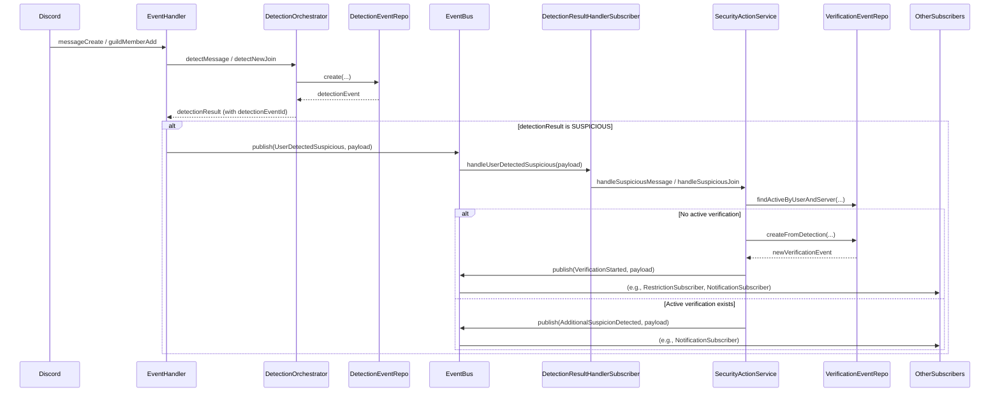

# Discord Anti-Spam Bot: System Patterns

## Project Overview

The Discord Anti-Spam Bot follows a modular, service-oriented architecture with clear separation of concerns, increasingly leveraging an internal event bus for decoupling. This document outlines the key architectural patterns and design decisions.

## Directory Structure

```
├── AGENTS.md                   # OpenCode project rules
├── .agents/                    # OpenCode skills (on-demand)
│   └── skills/
│       └── <skill-name>/SKILL.md
├── src/                        # Source code directory
│   ├── config/                # Configuration files
│   │   ├── supabase.ts       # Supabase client configuration
│   │   └── gpt-config.ts     # GPT configuration
│   ├── di/                    # Dependency injection
│   │   ├── container.ts      # InversifyJS container config
│   │   └── symbols.ts        # InversifyJS symbol definitions
│   ├── events/                # Event definitions and EventBus
│   │   ├── events.ts         # Event names and payload interfaces
│   │   └── EventBus.ts       # EventBus implementation
│   │   └── subscribers/      # Event subscriber classes
│   │       ├── RestrictionSubscriber.ts
│   │       ├── NotificationSubscriber.ts
│   │       ├── RoleUpdateSubscriber.ts
│   │       ├── ActionLogSubscriber.ts
│   │       ├── ServerMemberStatusSubscriber.ts
│   │       ├── DetectionResultHandlerSubscriber.ts # Added
│   │       ├── VerificationReopenSubscriber.ts   # Added
│   │       └── ... (other subscribers)
│   ├── repositories/          # Data access layer
│   │   ├── types.ts          # Database entity types
│   │   ├── BaseRepository.ts # Base repository interface
│   │   └── ServerRepository.ts   # Server configuration repository (Prisma)
│   ├── services/             # Core services
│   ├── controllers/          # Handlers for Discord events/interactions
│   │   ├── CommandHandler.ts
│   │   ├── EventHandler.ts
│   │   └── InteractionHandler.ts
│   ├── Bot.ts               # Main bot class
│   ├── initializers/        # Eager loading initializers
│   │   └── SubscriberInitializer.ts # Ensures subscribers are loaded
│   └── index.ts             # Application entry point
├── docs/
│   ├── context/             # Project context and architecture docs
│   └── legacy/              # Archived plans/learnings from earlier iterations
├── prisma/                  # Prisma schema, migrations, seed
├── supabase/                # Local Supabase config (for `npx supabase start`)
├── .env                    # Environment variables
└── configuration files     # Various config files (tsconfig.json, etc.)
```

## Core Components

### 1. Dependency Injection Container (di/container.ts)

The central configuration point for InversifyJS dependency injection:

- Configures the InversifyJS container with all dependencies
- Binds external dependencies (Discord client, OpenAI, PrismaClient)
- Registers repositories in singleton scope
- Registers services and subscribers in singleton or transient scope as appropriate
- Returns the configured container for use in the application
- Used by index.ts to obtain service instances
- Supports testing by providing mock implementations

### 2. Bot Class (Bot.ts)

The main entry point that:

- Implements the IBot interface
- Receives injected dependencies (`Client`, `EventHandler`) via constructor
- Logs into Discord
- Delegates event setup to `EventHandler`

### 3. Controllers (src/controllers/)

- **EventHandler.ts**: Sets up listeners for core Discord gateway events (`messageCreate`, `guildMemberAdd`, etc.). Orchestrates initial processing, calls `DetectionOrchestrator`, and publishes events like `UserDetectedSuspicious`.
- **CommandHandler.ts**: Registers and handles slash commands. For moderation commands (`/ban`), it now publishes request events (e.g., `AdminBanUserRequested`) instead of calling services directly.
- **InteractionHandler.ts**: Handles button interactions. For moderation buttons ('verify', 'ban'), it now publishes request events (e.g., `AdminVerifyUserRequested`, `AdminBanUserRequested`) instead of calling services directly.

### 4. Repository Pattern

#### Repository Interfaces (e.g., IServerRepository)

- Define the contract for data access operations specific to an entity.
- Ensure consistency and allow for dependency injection.

#### Repository Implementations (e.g., ServerRepository.ts)

- Implement the corresponding repository interface.
- Directly inject and use `PrismaClient` for database operations.
- Handle Prisma-specific errors and map them to `RepositoryError` if needed.
- Marked as `@injectable()` for dependency injection.
- Receive `PrismaClient` via `@inject(TYPES.PrismaClient)` decorator in the constructor.

#### BaseRepository.ts

- Contains the `RepositoryError` class for consistent error handling.
- (The `IBaseRepository` interface and `AbstractBaseRepository` class are no longer strictly necessary as Prisma Client provides strong typing, but interfaces like `IServerRepository` are still used for DI contracts).

### 5. Event Bus & Subscribers (src/events/)

- **EventBus (EventBus.ts)**: Simple pub/sub implementation using Node.js `EventEmitter`. Injected as a singleton.
- **Events (events.ts)**: Defines event names (constants) and strongly-typed payload interfaces (`EventMap`).
- **Subscribers (subscribers/)**: Classes that listen for specific events and trigger side effects. Instantiated via DI container. Key subscribers include:
  - `DetectionResultHandlerSubscriber`: Listens for `UserDetectedSuspicious` and calls `SecurityActionService`.
  - `RestrictionSubscriber`: Listens for `VerificationStarted` and calls `UserModerationService.restrictUser`.
  - `NotificationSubscriber`: Listens for `VerificationStarted` and `AdditionalSuspicionDetected` to send/update admin notifications.
  - `RoleUpdateSubscriber`: Listens for `UserVerified` and calls `RoleManager.removeRestrictedRole`.
  - `ActionLogSubscriber`: Listens for `UserVerified`, `UserBanned` to log actions via `NotificationManager`.
  - `ServerMemberStatusSubscriber`: Listens for `UserVerified`, `UserBanned` to update member status in the database.
  - `VerificationReopenSubscriber`: Listens for `VerificationReopened` to handle thread reopening, re-restriction, and logging.

### 6. Service Layer

#### ConfigService (ConfigService.ts)

- Implements IConfigService interface
- Manages server configurations with a cache-first approach
- Creates default configurations when none exist
- Bridges between environment variables and database storage
- Provides methods to get, update, and manage server settings
- Handles initialization of configurations on bot startup
- Marked as @injectable() and receives dependencies via constructor

#### DetectionOrchestrator (DetectionOrchestrator.ts)

- Implements IDetectionOrchestrator interface
- Orchestrates the spam detection process using heuristics and GPT.
- **Responsibility Change:** Now also responsible for creating the `DetectionEvent` record in the database before returning the result.
- Produces a final `DetectionResult` including the `detectionEventId`.
- Marked as @injectable() and receives service and repository dependencies via constructor.

#### GPTService (GPTService.ts)

- Implements IGPTService interface
- Integrates with OpenAI's API using gpt-4o-mini model
- Analyzes user profiles and messages for suspicious patterns
- Uses few-shot examples from gpt-config.ts to improve classification
- Formats prompts with structured user data and examples
- Returns "OK" or "SUSPICIOUS" classification
- Marked as @injectable() and receives OpenAI client via constructor

#### HeuristicService (HeuristicService.ts)

- Implements IHeuristicService interface
- Implements rule-based spam detection (frequency, keywords).
- Maintains a map of user message timestamps
- Provides fast, low-cost initial screening
- Marked as @injectable() for dependency injection

#### RoleManager (RoleManager.ts)

- Implements IRoleManager interface
- Manages the restricted role for flagged users
- Provides methods to assign and remove the restricted role (currently called directly by subscribers like `RoleUpdateSubscriber`).
- Handles role lookup and caching for better performance
- Marked as @injectable() and receives Discord client via constructor

#### NotificationManager (NotificationManager.ts)

- Implements INotificationManager interface
- Creates and sends/updates notifications to admin channels (called by `NotificationSubscriber`).
- Formats suspicious user embeds with detailed information.
- Creates interactive buttons for admin actions.
- Logs admin actions to notification messages (called by `ActionLogSubscriber`).
- Sets up verification channels with proper permissions.
- Marked as @injectable() and receives Discord client via constructor

#### ThreadManager (ThreadManager.ts)

- Implements IThreadManager interface
- Handles creation, locking, archiving, and reopening of verification threads.
- Called by subscribers like `VerificationReopenSubscriber`.
- Marked as @injectable() and receives Discord client and repository dependencies.

#### VerificationService (VerificationService.ts)

- (Note: This service might be redundant or need refactoring as its responsibilities are largely handled by repositories and events now).
- Manages the verification lifecycle for suspicious users
- Creates and updates verification events in the database
- Provides methods for verifying, rejecting, and reopening verifications
- Tracks verification history and status changes
- Marked as @injectable() and receives repository dependencies via constructor

#### AdminActionService (AdminActionService.ts)

- Implements IAdminActionService interface
- Records administrative actions taken on users (verify, reject, ban, reopen) in the database.
- Publishes `AdminActionRecorded` event after saving.
- Provides methods to retrieve action history by admin or user.
- Creates audit trail for moderation accountability.
- Marked as @injectable() and receives repository dependencies via constructor

#### SecurityActionService (SecurityActionService.ts)

- Implements ISecurityActionService interface
- **Responsibility Change:** No longer called directly by `EventHandler`. Now called by `DetectionResultHandlerSubscriber` based on the `UserDetectedSuspicious` event.
- Handles the _initiation_ of the verification workflow (`VerificationStarted` event) or updates for existing verifications (`AdditionalSuspicionDetected` event).
- Handles reopening verifications (`VerificationReopened` event).
- Ensures prerequisite entities (server, user) exist before creating verification events.
- Marked as @injectable() and receives service, repository, client, and event bus dependencies.

#### UserModerationService (UserModerationService.ts)

- Implements IUserModerationService interface
- **Responsibility Change:** No longer called directly by command/interaction handlers for verify/ban. Now subscribes to `AdminVerifyUserRequested` and `AdminBanUserRequested` events.
- Contains the core logic for verifying a user (updating event status, publishing `UserVerified`) and banning a user (performing Discord ban, updating event status, publishing `UserBanned`).
- Still contains `restrictUser` method (currently called by `RestrictionSubscriber`).
- Marked as @injectable() and receives service, repository, client, and event bus dependencies.

## Key Design Patterns

### 1. Dependency Injection with InversifyJS

Services, repositories, controllers, and subscribers are integrated using InversifyJS:

- Interface-based design with clear contracts
- Symbol-based dependency identification
- Constructor injection for dependencies
- Proper scoping (singleton vs transient)
- External dependency injection (Discord, OpenAI, PrismaClient)
- Testable architecture with mock injections

Example:

```typescript
// In container.ts
container.bind<IHeuristicService>(TYPES.HeuristicService).to(HeuristicService).inSingletonScope();
container
  .bind<DetectionResultHandlerSubscriber>(TYPES.DetectionResultHandlerSubscriber)
  .to(DetectionResultHandlerSubscriber)
  .inSingletonScope();

// In class implementation (e.g., DetectionResultHandlerSubscriber)
@injectable()
export class DetectionResultHandlerSubscriber {
  constructor(
    @inject(TYPES.EventBus) private eventBus: IEventBus,
    @inject(TYPES.SecurityActionService) private securityActionService: ISecurityActionService,
    @inject(TYPES.DiscordClient) private client: Client
  ) {
    this.subscribe();
  }
  // ...
}

// In index.ts
const container = configureContainer();
// Instantiate initializer to force eager loading of subscribers
container.get<ISubscriberInitializer>(TYPES.SubscriberInitializer);
const bot = container.get<IBot>(TYPES.Bot);
await bot.startBot();
```

### 2. Repository Pattern (with Prisma)

Data access is abstracted through repositories:

- **Interfaces (e.g., `IServerRepository`)**: Define the contract.
- **Implementations (e.g., `ServerRepository.ts`)**: Use injected `PrismaClient`.
- Provides centralized data access, testability, and type safety.

### 3. Service Pattern

Business logic is encapsulated in focused service classes (see descriptions above).

### 4. Event-Driven Architecture (Internal)

Core workflows are decoupled using an internal event bus:

- **Events**: Defined with strong types (`src/events/events.ts`).
- **Publishers**: Components publish events after completing primary tasks or receiving external triggers (e.g., `EventHandler` publishes `UserDetectedSuspicious`, `InteractionHandler` publishes `AdminVerifyUserRequested`).
- **Subscribers**: Dedicated classes (`src/events/subscribers/`) listen for events and handle specific side effects (e.g., `DetectionResultHandlerSubscriber` calls `SecurityActionService`, `UserModerationService` listens for admin requests).
- **Decoupling**: Reduces direct dependencies, improving maintainability and testability.

### 5. Command Pattern

Slash commands and button interactions follow the command pattern, now primarily triggering events rather than direct service calls for moderation actions.

### 6. Caching Strategy

The ConfigService implements a cache-first approach for server configurations.

### 7. Eager Subscriber Initialization Pattern

To ensure singleton event subscribers are instantiated immediately at startup (rather than lazily loaded) and can register their listeners before any events are fired, a dedicated initializer service (`SubscriberInitializer`) is used:

- The `SubscriberInitializer` injects all necessary subscribers in its constructor.
- It is bound as a singleton in the DI container.
- The main application bootstrap (`index.ts`) explicitly resolves (`container.get()`) the `SubscriberInitializer`.
- This single `get()` call triggers the instantiation of the initializer, which in turn forces InversifyJS to instantiate all injected subscribers, running their constructors and subscription logic.

## Data Flow Patterns

### 1. Suspicious User Detection & Initial Handling Flow (Event-Driven)



### 2. Admin User Verification/Ban Flow (Event-Driven)

```mermaid
sequenceDiagram
    participant Admin (via Discord Interaction)
    participant InteractionHandler / CommandHandler
    participant EventBus
    participant UserModerationService
    participant VerificationEventRepo
    participant Discord API
    participant OtherSubscribers (RoleUpdate, ActionLog, ServerMemberStatus)

    Admin (via Discord Interaction)->>InteractionHandler / CommandHandler: Button Click / Slash Command
    InteractionHandler / CommandHandler->>EventBus: publish(AdminVerifyUserRequested / AdminBanUserRequested, payload)

    EventBus->>UserModerationService: handleAdminVerifyRequest / handleAdminBanRequest
    UserModerationService->>VerificationEventRepo: findActiveByUserAndServer(...)
    opt Ban Request
        UserModerationService->>Discord API: member.ban(...)
    end
    UserModerationService->>VerificationEventRepo: update(status='verified'/'banned', resolved_by, resolved_at)
    VerificationEventRepo-->>UserModerationService: updatedEvent
    UserModerationService->>EventBus: publish(UserVerified / UserBanned, payload)

    EventBus->>OtherSubscribers (RoleUpdate, ActionLog, ServerMemberStatus): Handle side effects (remove role, log action, update member status)

```

_Note: The previous diagrams are updated to reflect the event-driven flow._

### 3. Configuration Flow

```
Request for Server Config → ConfigService.getServerConfig
├── Cache Check
├── If in Cache: Return Cached Config
└── If Not in Cache:
    ├── Database Lookup (ServerRepository.findByGuildId)
    ├── If Found: Update Cache and Return
    ├── If Not Found: Create Default Config
    │   ├── Save to Database
    │   └── Update Cache
    └── Return Config
```

### 4. Moderation Actions Flow (Updated)

```
Slash Command or Button Interaction → CommandHandler / InteractionHandler
├── Command/Interaction Parsing and Validation
├── Event Publishing:
│   ├── Verify Request: Publish AdminVerifyUserRequested
│   ├── Ban Request: Publish AdminBanUserRequested
│   └── Create Thread: (Still likely direct call to ThreadManager/NotificationManager or could be event)
├── User Notification (ephemeral reply acknowledging request)
└── (Actual action execution and logging handled by subscribers)
```

### 5. Dependency Resolution Flow (with InversifyJS)

```
Application Start → index.ts
├── Configure DI Container (container.ts)
│   ├── Configure External Dependencies
│   ├── Configure Repositories
│   └── Configure Services & Subscribers
├── Resolve Initializer (container.get<ISubscriberInitializer>(TYPES.SubscriberInitializer))
│   └── (This forces instantiation of all injected Subscribers)
├── Resolve Bot Instance (container.get<IBot>(TYPES.Bot))
└── Start Bot (bot.startBot())
```

## Error Handling Strategy

1.  **Service/Subscriber-Level Error Handling**: Try/catch blocks around critical operations, detailed logging.
2.  **Repository Error Handling**: Custom `RepositoryError`, specific Prisma error handling.
3.  **Top-Level Error Handling**: `EventHandler` catches errors in Discord event handlers. Interaction/Command handlers catch errors and reply ephemerally.
4.  **Graceful Degradation**: Default to safer outcomes (e.g., "OK" from GPT on error).

## Testing Approach

1.  **Unit Tests**: Mock dependencies using InversifyJS test utilities. Test individual services and subscribers.
2.  **Integration Tests**: Test container configuration, critical event flows (publisher -> subscriber -> action).
3.  **InversifyJS Testing Utilities**: Use helpers like `createTestContainer`, `createServiceTestContainer`.
4.  **Real API Tests**: For external services like OpenAI (run locally).

## Extension Points

The architecture provides several extension points:

1.  **New Commands/Interactions**: Add handlers, potentially publish new request events.
2.  **New Events & Subscribers**: Define new events, create subscribers to handle new side effects or workflows.
3.  **New Detection Methods**: Add services, integrate into `DetectionOrchestrator`.
4.  **Database Schema Extensions**: Use `prisma migrate dev`, create/update repositories.
5.  **Configuration Extensions**: Add settings to `ConfigService` and relevant interfaces.

## Development Guidelines

### 1. Service/Subscriber Integration

- Implement interfaces.
- Use constructor injection.
- Register components in the container.
- Prefer publishing events over direct calls for cross-domain actions or side effects.

### 2. Error Handling

- Comprehensive error catching.
- Service/subscriber-specific handling.
- Repository error wrapping.
- Graceful degradation.

### 3. Configuration

- Environment variables for secrets.
- Database-backed server config.
- `/config` command for runtime updates.
- Caching for performance.

### 4. Testing

- Unit tests for logic.
- Integration tests for flows and DI.
- Mock external dependencies.
