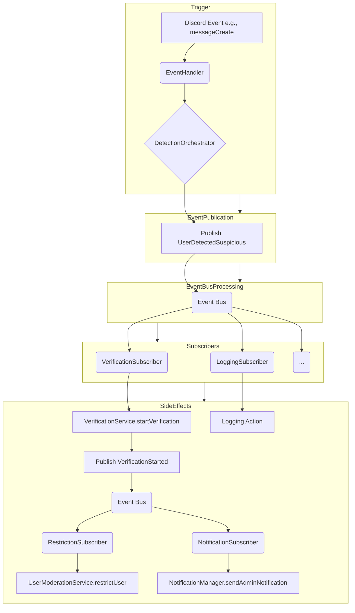

# Plan: Refactor Service Interactions to Event-Driven Architecture (EDA)

**Goal:** Refactor the core workflows (like handling suspicious users) to use events for triggering side effects, reducing direct service-to-service calls for secondary actions. This aims to decouple services, clarify responsibilities, and make the system more extensible and maintainable.

**Proposed Plan:**

## Phase 1: Foundation - Events & Event Bus

- **1.1. Define Core Business Events:**
  - Identify key moments in the workflows where side effects are triggered.
  - Define clear, descriptive event names (e.g., `UserDetectedSuspicious`, `VerificationStarted`, `UserVerified`, `UserBanned`, `VerificationThreadCreated`, `AdminActionRecorded`).
  - Define the data payload for each event (e.g., `UserDetectedSuspicious` payload might include `userId`, `serverId`, `detectionResult`, `sourceMessageId`). Create TypeScript interfaces for these event payloads.
  - **Documentation:** Document these events and their payloads within this plan or a dedicated `events.md` file.
- **1.2. Implement a Simple Event Bus:**
  - Create a basic `EventBus` class (e.g., using Node.js `EventEmitter` or a simple pub/sub implementation).
  - Implement `publish(eventName, payload)` and `subscribe(eventName, handler)` methods.
  - Integrate the `EventBus` into the Dependency Injection container (`src/di/container.ts`) as a singleton (`TYPES.EventBus`).
  - **Implementation:** Write the `EventBus` class and update the DI container.

## Phase 2: Refactoring - Publishers & Subscribers

- **2.1. Refactor Services to Publish Events:**
  - Identify services currently triggering side effects directly (e.g., `DetectionOrchestrator`, `SecurityActionService`, `UserModerationService`).
  - Inject the `EventBus` into these services.
  - Modify methods to publish the relevant event (defined in 1.1) after completing their primary task, instead of calling other services directly for side effects.
  - _Example:_ `DetectionOrchestrator.detectMessage` finishes analysis, determines `SUSPICIOUS`, and then calls `eventBus.publish('UserDetectedSuspicious', { userId, serverId, ... })`.
  - **Implementation:** Modify existing service code.
- **2.2. Create Event Subscribers:**
  - Create new classes or functions (Subscribers/Listeners) dedicated to handling specific side effects triggered by events.
  - Each subscriber will:
    - Inject necessary dependencies (repositories, specific utility services like `RoleManager` or `NotificationManager`).
    - Subscribe to one or more events using `eventBus.subscribe(...)`.
    - Implement the logic for the side effect within the handler function.
  - _Examples:_
    - `VerificationSubscriber` listens for `UserDetectedSuspicious`, calls `VerificationService.startVerification`.
    - `RestrictionSubscriber` listens for `VerificationStarted`, calls `UserModerationService.restrictUser`.
    - `NotificationSubscriber` listens for `VerificationStarted`, calls `NotificationManager.sendAdminNotification`.
  - Register these subscribers in the DI container (`src/di/container.ts`) so they are instantiated and subscribe upon application start.
  - **Implementation:** Create new subscriber classes/functions and update the DI container.

## Phase 3: Cleanup & Validation

- **3.1. Remove Direct Calls:**
  - Once subscribers handle the side effects, remove the now-redundant direct service calls from the original publisher services.
  - Refactor or potentially remove services that primarily acted as orchestrators of side effects (like parts of `SecurityActionService`).
  - **Implementation:** Modify existing service code.
- **3.2. Testing:**
  - Update existing unit tests for refactored services (verify they publish correct events).
  - Write new unit tests for subscribers (verify they perform the correct action when receiving an event).
  - Write integration tests to verify the end-to-end flow through the event bus.
  - **Implementation:** Modify/create test files.
- **3.3. Documentation:**
  - Update `systemPatterns.md` to describe the new EDA pattern, including diagrams showing event flows.
  - Update `activeContext.md` and `progress.md` to reflect the refactoring status.
  - Update service descriptions in relevant Memory Bank files.
  - Update `.clinerules` with EDA as a core pattern.
  - **Implementation:** Update documentation files.

## Conceptual Flow Diagram (Post-Refactor)

This plan provides a structured way to introduce EDA. We would tackle it phase by phase, likely starting with one core workflow (like handling suspicious messages) to validate the approach before applying it more broadly.
