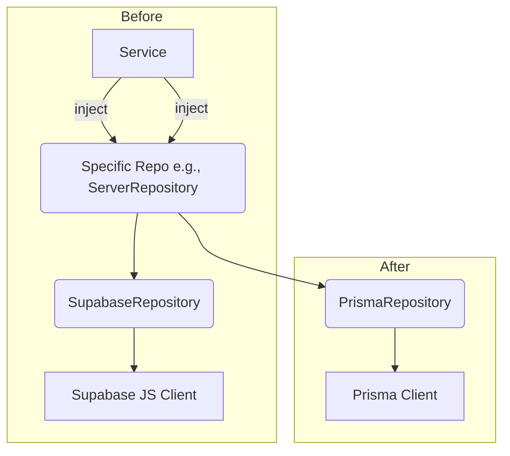

# Plan: Migrate Data Access Layer to Prisma

**Goal:** Replace the current Supabase JS client-based data access layer with Prisma ORM, following the Supabase Prisma integration guide, while maintaining the existing Repository pattern and test coverage.

**References:**

- Supabase Prisma Guide: [https://supabase.com/docs/guides/database/prisma](https://supabase.com/docs/guides/database/prisma)
- Memory Bank Files: `projectbrief.md`, `productContext.md`, `systemPatterns.md`, `techContext.md`, `activeContext.md`, `progress.md`
- Current Schema: `supabase/migrations/20250327000000_initial_schema.sql`
- Current Repositories: `src/repositories/`

---

## Migration Steps

### Phase 1: Preparation & Setup

1.  **Create Dedicated Prisma DB User:**

    - **Action:** Execute the SQL provided in the Supabase guide (Step 1) in the Supabase SQL Editor to create a new database user named `prisma` with appropriate permissions.
    - **Rationale:** Security best practice, isolates Prisma's access, aids monitoring.
    - **Artifact:** Securely store the generated password.

2.  **Install Prisma Dependencies:**

    - **Action:** Add Prisma CLI and Client as development dependencies.
      ```bash
      npm install prisma @prisma/client --save-dev
      ```
    - **Rationale:** Required tools for Prisma integration.

3.  **Initialize Prisma:**

    - **Action:** Run `npx prisma init`.
    - **Result:** Creates `prisma/schema.prisma` and updates `.env` with a placeholder `DATABASE_URL`.
    - **Note:** We will populate `schema.prisma` via introspection in the next phase.

4.  **Configure Database Connection:**
    - **Action:** Update the `DATABASE_URL` in the `.env` file.
      - Retrieve the Supavisor Session Mode connection string (port 5432) from Supabase Dashboard > Project Settings > Database.
      - Replace `[DB-USER]` with `prisma`.
      - Replace `[PRISMA-PASSWORD]` with the password created in Step 1.1.
      - Example: `DATABASE_URL="postgres://prisma.[PROJECT-REF]:[YOUR-SECURE-PASSWORD]@[DB-REGION].pooler.supabase.com:5432/postgres"`
    - **Rationale:** Connects Prisma to the Supabase database via the recommended connection pooler.
    - **(Optional but Recommended for Serverless):** Also add the Transaction Mode string (port 6543) as `DATABASE_URL_TRANSACTION` or similar if serverless deployment is planned, as Prisma Migrate requires the direct connection or transaction pooler.

### Phase 2: Schema Generation & Client Setup

1.  **Introspect Existing Database Schema:**

    - **Action:** Pull the current database schema into `prisma/schema.prisma`.
      ```bash
      npx prisma db pull
      ```
    - **Rationale:** Generates Prisma schema definitions based on the existing tables created by `supabase/migrations`.
    - **Verification:** Review the generated `prisma/schema.prisma` file for correctness and compare it against the SQL schema (`supabase/migrations/20250327000000_initial_schema.sql`). Adjust types or relations if introspection wasn't perfect.

2.  **Generate Prisma Client:**
    - **Action:** Generate the type-safe Prisma Client based on the schema.
      ```bash
      npx prisma generate
      ```
    - **Result:** Creates/updates `@prisma/client` in `node_modules` with types specific to the project schema.

### Phase 3: Repository Layer Migration

**Strategy:** Replace the Supabase JS client logic within the existing repository structure by adapting the base repository implementation to use Prisma Client.



1.  **Adapt Base Repository:**

    - **Action:** Create a new base repository class (e.g., `PrismaRepository.ts`) or modify the existing `BaseRepository.ts` and `SupabaseRepository.ts`. The goal is to have a base implementation that uses `PrismaClient` instead of `SupabaseClient`.
    - Inject `PrismaClient` into this new base class.
    - Re-implement the base CRUD methods (`findById`, `findMany`, `create`, `update`, `delete`) using `PrismaClient` syntax.
    - **Consideration:** Prisma's API might differ slightly (e.g., error handling, return types). Adapt the base class methods accordingly.

2.  **Update Specific Repositories:**
    - **Action:** Modify each specific repository (`ServerRepository.ts`, `UserRepository.ts`, `ServerMemberRepository.ts`, `DetectionEventsRepository.ts`, `VerificationEventRepository.ts`, `AdminActionRepository.ts`) to:
      - Extend the new `PrismaRepository` base class (if created).
      - Replace all Supabase JS client calls (`this.client.from(...).select()`, `.insert()`, `.update()`, `.delete()`, etc.) with their equivalent `PrismaClient` calls (e.g., `this.prisma.server.findUnique()`, `.create()`, `.update()`, `.delete()`).
      - Adjust method logic and return types as needed based on Prisma Client's behavior.
    - **Verification:** Ensure all existing repository methods are successfully migrated to use Prisma Client.

### Phase 4: Dependency Injection Update

1.  **Inject Prisma Client:**
    - **Action:** Modify `src/di/container.ts`.
      - Instantiate `PrismaClient` (likely as a singleton).
      - Bind `PrismaClient` to a new symbol (e.g., `TYPES.PrismaClient`).
      - Update the binding for the base repository implementation (e.g., `PrismaRepository`) to inject `PrismaClient`.
      - Remove bindings for the `SupabaseClient` if it's no longer directly injected anywhere (it might still be needed if other parts of the app use it, but repositories shouldn't).
    - **Rationale:** Provides the Prisma Client instance to the data access layer via DI.

### Phase 5: Refinement & Validation

1.  **Local Testing:**

    - **Action:** Run the bot locally (`npm run dev`).
    - Test all features that involve database interaction:
      - Bot startup (config loading)
      - `/config` command
      - User joining server
      - Message sending (detection)
      - Admin actions (verify, ban, create thread)
      - Any other DB-dependent features.
    - **Rationale:** End-to-end validation of the migrated data layer.

2.  **Debugging:**
    - **Action:** Monitor logs for any Prisma-related errors. Debug and fix issues found during local testing.

### Phase 6: Documentation & Cleanup

1.  **Update Memory Bank:**

    - **Action:** Modify relevant Memory Bank files:
      - `techContext.md`: Update Technology Stack, External Services Integration, Testing Strategy sections.
      - `systemPatterns.md`: Update Repository Pattern description and diagrams.
      - `activeContext.md` / `progress.md`: Mark migration as completed.
    - **Rationale:** Keep documentation consistent with the codebase.

2.  **Update `.clinerules`:**

    - **Action:** Add any new patterns or preferences related to Prisma usage if discovered during the migration.

3.  **Code Cleanup:**
    - **Action:** Remove the old `SupabaseRepository.ts` implementation (or commented-out Supabase client code).
    - Remove unused Supabase client imports.
    - Consider removing `supabase-js` dependency from `package.json` if it's no longer used anywhere else.

### Phase 7: Future Schema Management

1.  **Adopt Prisma Migrate:**
    - **Recommendation:** For future database schema changes, use `prisma migrate dev` instead of creating new SQL files in `supabase/migrations/`.
    - **Action:**
      - Ensure the `prisma/schema.prisma` file is the source of truth for the schema.
      - Run `npx prisma migrate dev --name <migration-name>` to create and apply new migrations.
      - This will keep the Prisma schema and the database synchronized.
    - **Rationale:** Consolidates schema management within the Prisma workflow.

---

## Potential Challenges

- **API Differences:** The Prisma Client API differs from the Supabase JS client API. Careful mapping of methods and handling of return types/errors is required.
- **Complex Queries:** Migrating complex queries might require learning more advanced Prisma features.
- **Testing Mock Complexity:** Setting up Prisma client mocking can be more involved than the previous Supabase client mocks.
- **Migration Tool Conflict:** Decide definitively whether to use `prisma migrate` or Supabase migrations going forward to avoid conflicts. (Plan recommends switching to `prisma migrate`).
