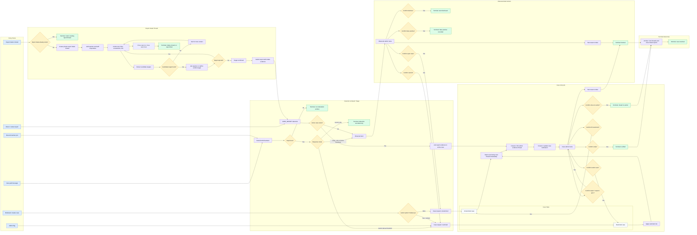

# Moderation Flow

This diagram is the product-level map for how reports, observed detections, and
manual moderator actions converge into cases.

```mermaid
flowchart LR
  classDef start fill:#dbeafe,stroke:#2563eb,color:#0f172a
  classDef terminal fill:#dcfce7,stroke:#16a34a,color:#0f172a
  classDef state fill:#f8fafc,stroke:#64748b,color:#0f172a
  classDef decision fill:#fef3c7,stroke:#d97706,color:#0f172a
  classDef action fill:#ede9fe,stroke:#7c3aed,color:#0f172a

  subgraph Entry["Entry Points"]
    direction TB
    NewMessage["New guild message"]
    NewJoin["Discord member join"]
    ReportButton["Report button clicked"]
    DirectReport["Direct / context report"]
    ModeratorCase["Moderator creates case"]
    AdminFlag["Admin flag"]
  end

  subgraph Intake["Report Intake Thread"]
    direction TB
    ReportButton --> ExistingIntake{"Open intake already exists?"}
    ExistingIntake -->|"Yes"| ExistingThread["Terminal: return existing report thread"]
    ExistingIntake -->|"No"| CreateIntake["Create private report intake thread"]
    CreateIntake --> AddReporter["Add reporter and staff responders"]
    AddReporter --> CollectEvidence["Collect text, links, screenshots, IDs"]
    CollectEvidence --> ExtractTargets["Extract candidate targets"]
    ExtractTargets --> CandidateFound{"Candidate target found?"}
    CandidateFound -->|"No"| NeedMore["Ask for more context"]
    NeedMore --> CollectEvidence
    CandidateFound -->|"Yes"| AskTargetConfirm["Ask reporter or staff to confirm target"]
    AskTargetConfirm --> TargetRejected{"Target rejected?"}
    TargetRejected -->|"Yes"| CollectEvidence
    TargetRejected -->|"No"| TargetConfirmed["Target confirmed"]
    TargetConfirmed --> SubmitIntakeReport["Submit report with intake evidence"]
    CollectEvidence --> CloseIntake["/close-report or close report text"]
    CloseIntake --> IntakeClosed["Terminal: intake closed, no report filed"]
  end

  subgraph Triage["Detection & Report Triage"]
    direction TB
    NewMessage --> Detection["DetectionOrchestrator"]
    NewJoin --> Detection
    Detection --> Suspicious{"Suspicious?"}
    Suspicious -->|"No"| NoModeration["Terminal: no moderation surface"]
    Suspicious -->|"Yes"| ResponseMode{"Response mode"}

    ResponseMode -->|"record_only"| RecordedOnly["Terminal: detection recorded only"]
    ResponseMode -->|"notify_only or below threshold"| ObservedAlert["Observed alert"]
    ResponseMode -->|"restrict above threshold"| RequestRestricted["Case request: restricted"]

    DirectReport --> UserReport["USER_REPORT detection"]
    SubmitIntakeReport --> UserReport
    UserReport --> ActiveCase{"Active case exists?"}
    ActiveCase -->|"Yes"| LinkEvidence["Link report evidence to active case"]
    ActiveCase -->|"No"| ObservedAlert

    AdminFlag --> RequestRestricted
    ModeratorCase --> ModeratorRestrict{"restrict option? default yes"}
    ModeratorRestrict -->|"true / omitted"| RequestRestricted
    ModeratorRestrict -->|"false"| RequestUnrestricted["Case request: unrestricted"]
  end

  subgraph Observed["Observed Alert Actions"]
    direction TB
    ObservedAlert --> ObservedMenu["Observed admin menu"]
    ObservedMenu --> OpenObserved{"Confirm open case?"}
    ObservedMenu --> RestrictObserved{"Confirm restrict?"}
    ObservedMenu --> DismissObserved{"Confirm dismiss?"}
    ObservedMenu --> FalsePositiveObserved{"Confirm false positive?"}
    ObservedMenu --> BanObserved["Ban reason modal"]

    OpenObserved -->|"Yes"| RequestUnrestricted
    RestrictObserved -->|"Yes"| RequestRestricted
    DismissObserved -->|"Yes"| AlertDismissed["Terminal: alert dismissed"]
    FalsePositiveObserved -->|"Yes"| FalsePositive["Terminal: false positive recorded"]
    BanObserved --> Banned
  end

  subgraph Case["Case Lifecycle"]
    direction TB

    subgraph CaseState["Case State"]
      direction LR
      UnrestrictedCase["Unrestricted case"]
      RestrictedCase["Restricted case"]
    end

    RequestUnrestricted --> UnrestrictedCase
    RequestRestricted --> RestrictedCase

    RestrictedCase --> ApplyRestriction["Apply restricted role"]
    ApplyRestriction --> CaseThread["Open user-facing case thread immediately"]
    UnrestrictedCase --> CaseThread

    CaseThread --> EvidenceThread["Create or link admin evidence thread"]
    LinkEvidence --> EvidenceThread
    EvidenceThread --> CaseNotification["Create or update case notification"]
    CaseNotification --> CaseMenu["Case admin menu"]

    CaseMenu --> RestrictUser{"Confirm restrict user?"}
    CaseMenu --> LiftRestriction{"Confirm lift restriction?"}
    CaseMenu --> VerifyUser{"Confirm verify?"}
    CaseMenu --> CloseNoAction{"Confirm close no action?"}
    CaseMenu --> BanUser["Ban reason modal"]
    CaseMenu --> RepairCase{"Confirm repair / reopen / sync?"}

    RestrictUser -->|"Yes"| RestrictedCase
    LiftRestriction -->|"Yes"| UnrestrictedCase
    VerifyUser -->|"Yes"| Verified
    CloseNoAction -->|"Yes"| ClosedNoAction
    BanUser --> Banned
    RepairCase -->|"Yes"| CaseMenu
  end

  subgraph Terminals["Terminal Outcomes"]
    direction TB
    Verified["Terminal: verified"]
    ClosedNoAction["Terminal: closed no action"]
    Banned["Terminal: banned"]
    Resolve["Archive / lock threads and close linked reports"]
    CaseResolved["Terminal: case resolved"]

    Verified --> Resolve
    ClosedNoAction --> Resolve
    Banned --> Resolve
    Resolve --> CaseResolved
  end

  class NewMessage,NewJoin,ReportButton,DirectReport,ModeratorCase,AdminFlag start
  class ExistingThread,IntakeClosed,NoModeration,RecordedOnly,AlertDismissed,FalsePositive,Verified,ClosedNoAction,Banned,CaseResolved terminal
  class ExistingIntake,CandidateFound,TargetRejected,Suspicious,ResponseMode,ActiveCase,ModeratorRestrict,OpenObserved,RestrictObserved,DismissObserved,FalsePositiveObserved,RestrictUser,LiftRestriction,VerifyUser,CloseNoAction,RepairCase decision
  class CreateIntake,AddReporter,CollectEvidence,ExtractTargets,NeedMore,AskTargetConfirm,TargetConfirmed,SubmitIntakeReport,Detection,UserReport,ObservedAlert,ObservedMenu,RequestRestricted,RequestUnrestricted,ApplyRestriction,CaseThread,EvidenceThread,CaseNotification,CaseMenu,Resolve,BanObserved,BanUser,LinkEvidence action
  class UnrestrictedCase,RestrictedCase state
```
