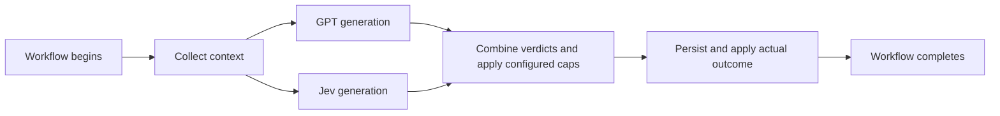
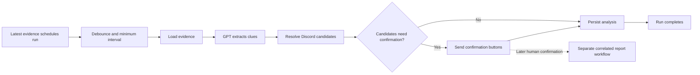

# Langfuse observability design

[AGENT]

Issue: [#101](https://github.com/BASIC-BIT/drasil/issues/101)

Date: 2026-10-01. Source reviewed: `b5626b2ab1173ba68f75991d55926497e0801c42`.

## Goal and agreed decisions

Replace unused Phoenix tracing with Langfuse Cloud. Show the full execution of each
model-assisted workflow: model inputs and outputs, parallel calls, verdicts, errors,
cost, and the resulting application actions. Use Langfuse's existing graph and timing
views, with a small number of meaningful observations.

The maintainer approved Langfuse Cloud, complete lifecycle tracing, accurate cost
labeling, and full content capture. Full capture includes report text, verification
conversations, staff notes, and image descriptions supplied to models. This replaces
the issue's earlier redaction-by-default proposal. Runtime credentials and
authorization headers remain excluded.

Project selection is a setup step: reuse an existing dedicated Drasil Cloud project
if one exists; otherwise create a Drasil project in the existing organization. Use
native `development` and `production` environments within the project. Project
access and creation have not been checked or performed during planning.

## Current implementation

- `GPTService` makes five structured OpenAI Responses calls: profile classification,
  report triage, verification replies, profile image description, and report intake
  extraction. Only profile classification has a custom OpenTelemetry span.
- `JevService` makes direct HTTP calls for profile, report text, and verification
  analyses. Missing credentials return `UNAVAILABLE` silently; other failures also
  collapse into that result. Its schema currently discards provider usage.
- `DetectionOrchestrator`, `ReportAiAnalyzer`, and
  `VerificationThreadAnalysisService` run GPT and Jev in parallel.
- `ReportIntakeAgentService` is a fixed workflow: gather evidence, call GPT to extract
  clues, resolve Discord candidates, send confirmation buttons when needed, and
  persist results. It schedules work through a debounce timer. There is no
  model-selected tool-call loop or multi-agent delegation in current bot code.
- Automatic clean checks do not create detection events. Verification metadata
  keeps the latest analysis, not an append-only model-call history.
- GPT usage normalization currently keeps only aggregate input/output/total counts,
  losing cached and reasoning token details. Existing hashed identifiers can be reused.

## Instrumentation architecture

Use explicit Langfuse observations through `@langfuse/tracing`, exported by
`@langfuse/otel` and the Node OpenTelemetry SDK. Keep `@opentelemetry/api`. Replace
`src/observability/phoenix.ts` with a small Langfuse initialization/shutdown module;
reuse `src/observability/hash.ts`.

Initialize after dotenv loads and before the dependency container/model clients.
Use manual instrumentation at the existing call sites so parsed verdicts, fallback
results, and unavailable outcomes are recorded together. Do not also auto-instrument
OpenAI: each logical provider request should have one generation observation.
Verify CommonJS compatibility and the existing OpenTelemetry dependency overrides
when choosing package versions; prune Phoenix-only overrides after removal.

Use native context propagation for async work and `Promise.all`. Workflow roots are
`chain` observations. GPT/Jev requests are `generation` observations. Meaningful
context/candidate lookups are `retriever` observations; Discord actions are `tool`
observations; verdict combination and grouped persistence are ordinary spans.
These types describe actual work. Do not label parallel classifiers as agents or
add an agent framework solely to produce a graph.

Explicitly export Drasil's selected observations. Do not install blanket HTTP,
Discord, database, or function instrumentation.

## Workflow structure and lifecycle

### Automatic checks, report triage, and verification

The root must encompass the existing analysis and the immediate application actions,
not end when a provider responds. Record the combined verdict, contributing
classifiers/heuristics, configured restrictions, and the outcome actually completed.
A recommendation to restrict or open a case is not proof that an action occurred.
Verification currently updates diagnostics and metadata; trace that behavior
without introducing a new moderation action. Image-only report triage has no Jev
request: record its omission as `not_applicable`, not `UNAVAILABLE`.

Automatic checks include successful clean results. Record `no_action` when no
moderation action is taken. Attach detection and case IDs once available, without
creating extra database records just to obtain an ID. Keep unrelated asynchronous
maintenance outside the workflow's completion boundary.

### Report intake workflow

Start a fresh trace when a scheduled run executes. Record the triggering evidence
message, latest scheduling timestamp, actual start time, and scheduling delay as
metadata. Superseded debounce timers do not create dangling traces or provider
calls. End the trace after candidate resolution, confirmation delivery when needed,
and persistence. A later reporter confirmation is another trace in the same intake
session, not a span left open while waiting for a human.

### Correlation and timing

- Use a shared trace parent for all calls within one run, including concurrent
  classifiers. Nested image-description calls belong to the workflow that caused them.
- Use environment-qualified intake/case session IDs for repeated runs. When neither
  ID exists, keep a standalone trace; do not invent a case or group unrelated checks.
- Include operation, trigger kind, prompt/schema version, requested and returned
  model, deployment commit, and available detection/intake/case IDs. Use existing
  hashed user/guild identifiers in correlation metadata.
- Span boundaries provide execution durations. Root duration is wall-clock time,
  not the sum of overlapping provider durations. Record debounce delay separately.
- End every started observation on success, fallback, error, and early unavailable
  returns. Skips before an eligible run need no trace.

## Full content capture

Capture the actual model request body and returned model content, including
instructions, schemas/questions, state, structured responses, and image references.
Also capture the parsed application verdict and fallback status. Trace what was
actually sent after existing prompt limits/transforms, not a reconstructed or
expanded conversation. Do not change prompt limits or model behavior for tracing.

Keep content on the observation that uses it instead of duplicating full
conversations in every parent/child. Inputs that contain image URLs remain image
references; use native rendering without adding a custom media pipeline.

Never serialize environment variables, client objects, request headers, connection
strings, or runtime secrets. Export only explicitly selected request/response
fields. Sanitize exception details; raw provider error bodies and exception stacks
are not part of full model-content capture. Traces remain private in Langfuse.

## Usage and cost

Record usage and cost only on generation observations. Parent totals should be
Langfuse's aggregation of children, with no duplicate costs copied to workflow roots.
Mark cost coverage as partial when a dispatched generation has unknown cost, so a
sum of known costs is not presented as the complete workflow cost.

- Read GPT usage from the original response before aggregate normalization loses
  details. Convert inclusive provider counts into non-overlapping input, cached
  input, output, and reasoning-output buckets. Preserve returned model and pricing
  tier information when provided. Use Langfuse's matching model definitions.
- Parse optional Jev usage from the documented provider response without making
  missing usage invalidate an otherwise valid verdict. Add a custom model definition
  if Langfuse lacks the exact returned Jev version. Official pricing checked on
  2026-10-01 is USD 0.042 per million input tokens, with free output; verify the
  account rate during setup before configuring prices.
- Label monetary values with their source: provider-reported when supplied,
  otherwise a pricing estimate based on reported usage. Missing usage or a missing
  matching price is unknown, not zero. Do not estimate tokens by string length.
- A missing-key outcome made no request and incurred no model cost. A timeout or
  network failure after dispatch has unknown usage/cost unless the provider reports
  otherwise. Retain billed usage for malformed or unusable responses when available.
- Preserve current provider retry behavior. Do not introduce per-attempt tracing or
  claim invoice reconciliation when SDK-hidden attempts have no reported usage.

## Failures and operational configuration

Distinguish `missing_key`, `timeout`, `http_error`, `invalid_response`, and
`network_error` for Jev. Store HTTP status when available and a bounded sanitized
message. Keep provider request outcome distinct from application fallback: GPT's
fallback `OK` must not look like a successful clean classifier verdict.

Use `LANGFUSE_PUBLIC_KEY`, `LANGFUSE_SECRET_KEY`, the project's regional
`LANGFUSE_BASE_URL`, `LANGFUSE_TRACING_ENVIRONMENT`, and `LANGFUSE_RELEASE`. Retain an
explicit `LANGFUSE_TRACING_ENABLED=true` opt-in. When enabled, capture full content;
no separate content-redaction feature is needed for this agreed scope.

Store environment-specific credentials through the existing AWS Secrets Manager
and local env hydration patterns. Add the required ECS secret references/permissions
and environment settings. Never log credentials. Missing/partial Langfuse
configuration must leave moderation working and report a sanitized configuration
warning when tracing was requested.

Export asynchronously using SDK batching. Initialization, observation, and export
failures must not change provider results or interrupt moderation. Attempt a bounded
flush during shutdown independently of bot/analytics cleanup, even if one cleanup
fails. Limit the telemetry shutdown wait to 3 seconds; preserve the existing application
shutdown outcome if telemetry fails or exceeds that limit.

## Change surface and scope limits

Primary files: observability module and hash helper, `src/index.ts`, `GPTService`,
`JevService`, `DetectionOrchestrator`, `ReportAiAnalyzer`,
`VerificationThreadAnalysisService`, `ReportIntakeAgentService`, and the existing
controller/report/security entry points needed to encompass actual outcomes.
Configuration includes package manifests, `.env.example`, env hydration, AWS bot
infrastructure/deployment docs, and a new `docs/dev/langfuse.md`.

Remove Phoenix dependencies, compose config, initialization, active documentation,
and obsolete Phoenix references. Keep changes within tracing/configuration;
no database migration, moderation-rule change, new retries, prompt management,
evaluation platform, custom dashboard, or generic observability abstraction.

## Verification and completion

Focused tests must demonstrate:

1. GPT/Jev siblings have the same root, remain correctly associated under concurrency,
   and produce one generation each. Clean results and image-only omissions are accurate.
2. Workflow roots encompass candidate lookup/actions/persistence, end on failures,
   and distinguish recommended actions from completed outcomes.
3. Scheduling delay is separate from run duration; later intake/case activity shares
   a session without keeping an earlier trace open.
4. Cached/reasoning tokens are not double-counted; Jev usage is preserved; known free
   output differs from unknown usage/cost; invalid responses retain available usage.
5. Full request/output content survives capture, while headers, runtime secrets,
   unsafe error details, and client objects never reach the exporter.
6. Disabled tracing, initialization/export failures, and shutdown flush failures
   do not alter existing moderation behavior.

Before production enablement is complete, run synthetic, side-effect-free provider
analyses and inspect delivered Langfuse traces: correct graph/tree, parallel timing,
full content, model/version labels, usage and pricing, environment/release, and no
runtime credentials. Include a missing-key/failure observation. Required CI alone
cannot prove live delivery. No live Discord moderation exercise is required.

Deliver the code/configuration migration in one PR. Project selection, credentials,
and deployment follow the reviewed design and implementation plan. This document
is planning only; no application changes or production enablement have begun.

## References

- [Langfuse instrumentation](https://langfuse.com/docs/observability/sdk/instrumentation)
- [Observation types](https://langfuse.com/docs/observability/features/observation-types)
- [Agent graphs](https://langfuse.com/docs/observability/features/agent-graphs)
- [Usage and cost rules](https://langfuse.com/docs/observability/features/token-and-cost-tracking)
- [Environments](https://langfuse.com/docs/observability/features/environments)
- [SDK v5 migration and filtering](https://langfuse.com/docs/observability/sdk/upgrade-path/js-v4-to-v5)
- [TypeSafe model pricing](https://docs.typesafe.ai/models)
