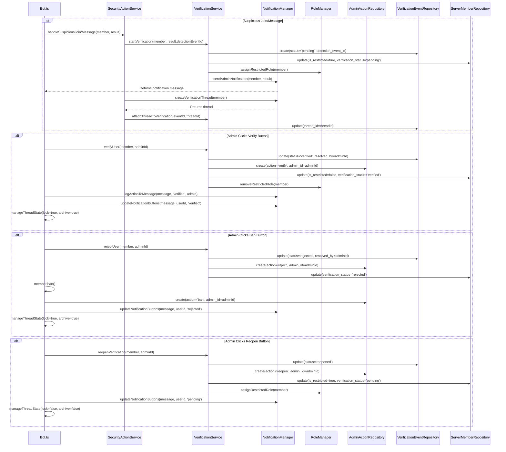

# Discord Anti-Spam Bot: System Patterns

## Project Overview

The Discord Anti-Spam Bot follows a modular, service-oriented architecture with clear separation of concerns. This document outlines the key architectural patterns and design decisions.

## Directory Structure

```
├── src/                        # Source code directory
│   ├── __tests__/             # Test files
│   │   ├── config/            # Configuration tests
│   │   ├── integration/       # Integration tests
│   │   ├── repositories/      # Repository tests
│   │   └── utils/             # Test utilities
│   ├── __mocks__/             # Mock files for testing
│   ├── config/                # Configuration files
│   │   ├── supabase.ts       # Supabase client configuration
│   │   └── gpt-config.ts     # GPT configuration
│   ├── di/                    # Dependency injection
│   │   ├── container.ts      # InversifyJS container config
│   │   └── symbols.ts        # InversifyJS symbol definitions
│   ├── repositories/          # Data access layer
│   │   ├── types.ts          # Database entity types
│   │   ├── BaseRepository.ts # Base repository interface
│   │   ├── SupabaseRepository.ts # Supabase implementation
│   │   └── ServerRepository.ts   # Server configuration repository
│   ├── services/             # Core services
│   ├── Bot.ts               # Main bot class
│   └── index.ts             # Application entry point
├── docs/                    # Legacy documentation (being migrated to memory-bank)
├── memory-bank/            # Project documentation and context
├── supabase/               # Supabase configuration
│   └── migrations/         # Database migrations
├── .env                    # Environment variables
└── configuration files     # Various config files (tsconfig.json, etc.)
```

## Core Components

### 1. Dependency Injection Container (di/container.ts)

The central configuration point for InversifyJS dependency injection:

- Configures the InversifyJS container with all dependencies
- Binds external dependencies (Discord client, OpenAI, Supabase)
- Registers repositories in singleton scope
- Registers services in singleton or transient scope as appropriate
- Returns the configured container for use in the application
- Used by index.ts to obtain service instances
- Supports testing by providing mock implementations

### 2. Bot Class (Bot.ts)

The central orchestrator that:

- Implements the IBot interface
- Receives injected dependencies via constructor
- Handles Discord events (messages, member joins, interactions)
- Registers and handles slash commands (/verify, /ban, /createthread, /ping, /setupverification)
- Coordinates verification and moderation actions
- Processes button interactions for admin actions
- Initializes server configurations on startup
- Handles new guild joins with automatic setup
- Records detection events through DetectionEventsRepository

### 3. Repository Pattern

#### BaseRepository (BaseRepository.ts)

- Interface and abstract class defining common CRUD operations (findById, findMany, create, update, delete)
- Provides a consistent contract for all repositories
- Enables type-safe database operations with generics

#### SupabaseRepository (SupabaseRepository.ts)

- Extends AbstractBaseRepository with Supabase-specific implementation
- Handles PostgrestError with custom RepositoryError class
- Implements all CRUD operations using Supabase client
- Provides additional utility methods like count()
- Marked as @injectable() for dependency injection
- Receives SupabaseClient via @inject() decorator

#### ServerRepository (ServerRepository.ts)

- Extends SupabaseRepository for server-specific operations
- Provides methods like findByGuildId, upsertByGuildId, updateSettings, setActive, findAllActive
- Manages server configuration persistence in the database
- Implements IServerRepository interface
- Marked as @injectable() for dependency injection

### 4. Service Layer

#### ConfigService (ConfigService.ts)

- Implements IConfigService interface
- Manages server configurations with a cache-first approach
- Creates default configurations when none exist
- Bridges between environment variables and database storage
- Provides methods to get, update, and manage server settings
- Handles initialization of configurations on bot startup
- Marked as @injectable() and receives dependencies via constructor

#### DetectionOrchestrator (DetectionOrchestrator.ts)

- Implements IDetectionOrchestrator interface
- Orchestrates the spam detection process
- Implements two main detection flows:
  - detectMessage: Analyzes user messages with heuristics first, then GPT if needed
  - detectNewJoin: Always uses GPT for new server joins
- Calculates suspicion scores based on multiple factors
- Determines when to use GPT based on user newness and suspicion level
- Records detection events in the database
- Produces a final DetectionResult with label, confidence, reasons, and trigger source
- Marked as @injectable() and receives service and repository dependencies via constructor

#### GPTService (GPTService.ts)

- Implements IGPTService interface
- Integrates with OpenAI's API using gpt-4o-mini model
- Analyzes user profiles and messages for suspicious patterns
- Uses few-shot examples from gpt-config.ts to improve classification
- Formats prompts with structured user data and examples
- Returns "OK" or "SUSPICIOUS" classification
- Marked as @injectable() and receives OpenAI client via constructor

#### HeuristicService (HeuristicService.ts)

- Implements IHeuristicService interface
- Implements rule-based spam detection:
  - Message frequency tracking (>5 messages in 10 seconds)
  - Suspicious keyword detection (nitro scam, free discord nitro, etc.)
- Maintains a map of user message timestamps
- Provides fast, low-cost initial screening
- Marked as @injectable() for dependency injection

#### RoleManager (RoleManager.ts)

- Implements IRoleManager interface
- Manages the restricted role for flagged users
- Provides methods to assign and remove the restricted role
- Handles role lookup and caching for better performance
- Falls back to environment variables if no role ID is configured
- Marked as @injectable() and receives Discord client via constructor

#### NotificationManager (NotificationManager.ts)

- Implements INotificationManager interface
- Creates and sends notifications to admin channels
- Formats suspicious user embeds with detailed information
- Creates interactive buttons for admin actions (verify, ban, create thread)
- Manages verification threads for suspicious users
- Logs admin actions to notification messages
- Sets up verification channels with proper permissions
- Marked as @injectable() and receives Discord client via constructor

#### VerificationService (VerificationService.ts)

- Implements IVerificationService interface
- Manages the verification lifecycle for suspicious users
- Creates and updates verification events in the database
- Provides methods for verifying, rejecting, and reopening verifications
- Tracks verification history and status changes
- Coordinates with RoleManager for role assignments
- Integrates with AdminActionRepository for audit trail
- Marked as @injectable() and receives repository dependencies via constructor

#### AdminActionService (AdminActionService.ts)

- Implements IAdminActionService interface
- Records administrative actions taken on users (verify, reject, ban, reopen)
- Provides methods to retrieve action history by admin or user
- Formats action summaries for display in notifications
- Creates audit trail for moderation accountability
- Marked as @injectable() and receives repository dependencies via constructor

#### UserModerationService (UserModerationService.ts)

- Implements IUserModerationService interface
- Coordinates user restriction and verification workflows
- Manages restricted role assignment and removal
- Updates verification status in the database
- Handles user banning and moderation actions
- Integrates with VerificationService for status tracking
- Marked as @injectable() and receives service dependencies via constructor

## Key Design Patterns

### 1. Dependency Injection with InversifyJS

Services are now integrated with full dependency injection using InversifyJS. The system uses:

- Interface-based design with clear contracts
- Symbol-based dependency identification
- Constructor injection for dependencies
- Proper scoping (singleton vs transient) for services
- External dependency injection (Discord, OpenAI, Supabase)
- Testable architecture with mock injections

Example:

```typescript
// In container.ts
container.bind<IHeuristicService>(TYPES.HeuristicService).to(HeuristicService).inSingletonScope();

// In class implementation
@injectable()
export class DetectionOrchestrator implements IDetectionOrchestrator {
  constructor(
    @inject(TYPES.HeuristicService) private heuristicService: IHeuristicService,
    @inject(TYPES.GPTService) private gptService: IGPTService,
    @inject(TYPES.DetectionEventsRepository)
    private detectionEventsRepository: IDetectionEventsRepository,
    @inject(TYPES.UserRepository) userRepository: IUserRepository,
    @inject(TYPES.ServerRepository) serverRepository: IServerRepository,
    @inject(TYPES.ServerMemberRepository) serverMemberRepository: IServerMemberRepository
  ) {
    // Constructor implementation
  }
}

// In index.ts
const container = configureContainer();
const bot = container.get<IBot>(TYPES.Bot);
await bot.startBot();
```

### 2. Repository Pattern

Data access is abstracted through repositories, providing a clean separation between business logic and data storage. The implementation follows a three-layer approach:

1. **BaseRepository**: Interface and abstract class defining the contract
2. **SupabaseRepository**: Generic implementation for Supabase
3. **ServerRepository**: Specific implementation for server entities

This pattern provides:

- Swappable data sources
- Centralized data access logic
- Simplified testing through mocking
- Type safety with generics

### 3. Service Pattern

Business logic is encapsulated in focused service classes with single responsibilities. Each service has a clear domain:

- **HeuristicService**: Rule-based spam detection
- **GPTService**: AI-powered analysis
- **DetectionOrchestrator**: Coordination of detection strategies
- **RoleManager**: Role assignment and management
- **NotificationManager**: Admin notifications and verification threads
- **ConfigService**: Configuration management
- **UserService**: User and server membership management

### 4. Event-Driven Architecture

The system is driven by Discord events that trigger specific workflows:

- **messageCreate**: Triggers message analysis workflow
- **guildMemberAdd**: Triggers new join analysis workflow
- **interactionCreate**: Handles slash commands and button interactions
- **guildCreate**: Sets up new servers when the bot joins
- **ready**: Initializes services and registers commands

### 5. Command Pattern

Slash commands and button interactions follow the command pattern:

- Commands are registered with Discord's API
- Each command has a dedicated handler method (handleVerifyCommand, handleBanCommand, etc.)
- Button interactions use a customId format (action_userId) to encode the action and target
- Handlers are dispatched based on command name or button ID

### 6. Caching Strategy

The ConfigService implements a cache-first approach for server configurations:

1. Check cache
2. If not in cache, fetch from database
3. Update cache with fetched data
4. Return data

This pattern is implemented in the getServerConfig method, which:

- First checks the serverCache Map
- Falls back to database lookup if not in cache
- Creates default configuration if none exists
- Always updates the cache with the latest data

## Data Flow Patterns

### 1. Message Processing Flow

```
Message Received → Bot.ts → DetectionOrchestrator
├── HeuristicService (Quick Check)
└── GPTService (Deep Analysis if user is new or borderline suspicious)
→ Final Decision → Action (via Bot.ts)
   ├── Record Detection Event
   ├── Assign Restricted Role (if suspicious)
   └── Send Admin Notification (if suspicious)
```

### 2. User Verification Flow



This diagram shows the complete verification flow, including the roles of VerificationService, AdminActionService, and related repositories in managing the verification lifecycle.

### 3. Configuration Flow

```
Request for Server Config → ConfigService.getServerConfig
├── Cache Check
├── If in Cache: Return Cached Config
└── If Not in Cache:
    ├── Database Lookup (ServerRepository.findByGuildId)
    ├── If Found: Update Cache and Return
    ├── If Not Found: Create Default Config
    │   ├── Save to Database
    │   └── Update Cache
    └── Return Config
```

### 4. Moderation Actions Flow

```
Slash Command or Button Interaction → Bot.ts
├── Command Parsing and Validation
├── Action Execution:
│   ├── Verify: RoleManager.removeRestrictedRole
│   ├── Ban: member.ban()
│   └── Create Thread: NotificationManager.createVerificationThread
├── User Notification (ephemeral reply)
└── Action Logging: NotificationManager.logActionToMessage
```

### 5. Dependency Resolution Flow (with InversifyJS)

```
Application Start → index.ts
├── Configure DI Container (container.ts)
│   ├── Configure External Dependencies
│   ├── Configure Repositories
│   └── Configure Services
├── Resolve Bot Instance (container.get<IBot>(TYPES.Bot))
└── Start Bot (bot.startBot())
```

## Error Handling Strategy

1. **Service-Level Error Handling**:

   - Each service handles its domain-specific errors
   - Try/catch blocks around critical operations
   - Detailed error logging with context

2. **Repository Error Handling**:

   - Custom RepositoryError class with cause tracking
   - Specific handling for PostgrestError vs general errors
   - Centralized error handling in handleError method

3. **Top-Level Error Handling**:

   - Bot.ts catches errors in event handlers and command processing
   - Interaction errors provide user feedback when possible
   - Console logging for all errors with stack traces

4. **Graceful Degradation**:
   - Default to "OK" classification if GPT service fails
   - Fall back to environment variables if database fails
   - Continue operation with reduced functionality when possible

## Testing Approach

1. **Unit Tests**:

   - Service-specific tests in **tests** directory
   - Mock dependencies with InversifyJS test utilities
   - Test both success and error paths
   - Use createServiceTestContainer for focused service testing

2. **Integration Tests**:

   - container.integration.test.ts for dependency resolution
   - Bot.integration.test.ts for end-to-end flows
   - Tests for critical paths like detection and notification

3. **InversifyJS Testing Utilities**:

   - createTestContainer(): Creates container with all dependencies mocked
   - createServiceTestContainer(): Creates container with a real service implementation
   - createMocks(): Creates mock implementations for all services and repositories
   - Custom mock implementations for external services (Discord, OpenAI, Supabase)

4. **Real API Tests**:
   - GPTService.realapi.test.ts for testing actual OpenAI integration
   - Only run locally, not in CI

## Extension Points

The architecture provides several extension points:

1. **New Commands**:

   - Add to commands array in Bot.ts constructor
   - Implement handler method in Bot class
   - Register with Discord API in registerCommands method

2. **New Detection Methods**:

   - Add new services or extend existing ones
   - Integrate into DetectionOrchestrator
   - Update detection result format if needed
   - Register in the DI container

3. **Database Schema Extensions**:

   - Add new migrations in supabase/migrations
   - Create new repository classes extending SupabaseRepository
   - Update types.ts with new entity interfaces
   - Register new repositories in the DI container

4. **Configuration Extensions**:
   - Add new settings to ServerSettings interface
   - Update GlobalConfig with new default values
   - Extend ConfigService methods as needed
   - Bind new configuration objects in the container

## Development Guidelines

### 1. Service Integration

- Services should implement interfaces
- Communication through well-defined interfaces
- Dependency injection via constructor with @inject decorators
- Register services in the container

### 2. Error Handling

- Comprehensive error catching in Bot.ts
- Service-specific error handling
- Repository error handling
- Graceful degradation when services fail

### 3. Configuration

- Environment variables for sensitive data
- Database-backed configuration
- Runtime configuration via Discord commands
- Cached configurations for performance

### 4. Testing

- Unit tests in `__tests__` directory
- Mocks in `__mocks__` directory
- Integration tests for critical paths
- Repository tests with Supabase mocking
- Use InversifyJS testing utilities for dependency injection testing
